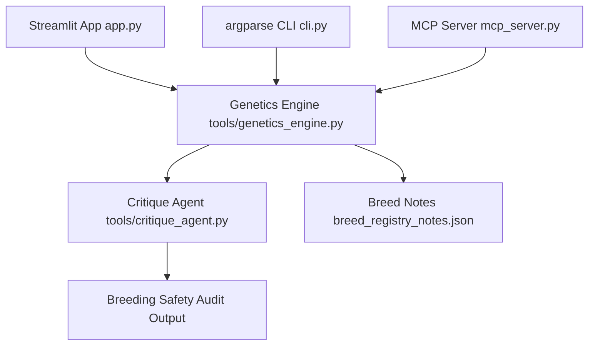

# 🧬 Equine Genetics Agent & Simulation Infrastructure
### A Decoupled, Multi-Agent Biological Framework with MCP Tooling, Terminal Skills, and Compliance Guardrails

**Written by:** Jennifer Bailey  
**Track Category:** Freestyle

---

## 1. Executive Summary & Problem Statement
The **Equine Genetics Agent & Simulation Infrastructure** is a production-grade biological simulation application designed to solve a critical, high-dimensional calculation and safety compliance problem in agricultural technology and computational biology.

### The Problem
Modern equine breeding management relies heavily on genetic data to optimize traits and prevent hereditary disorders. However, developing reliable software to automate this process introduces three significant architectural and computational challenges:

1. **Exponential Combinatorial Scaling:** Calculating inheritance frequencies across nine independent, multi-allelic genetic loci simultaneously is highly complex. Standard Punnett square approaches scale exponentially (4^n), meaning a single 9-loci cross must dynamically resolve, map, and aggregate up to 4^9 = 262,144 distinct genomic combinations in real time.
2. **Complex Biological Epistasis:** Genetic loci do not express themselves in isolation. Complex biological interactions and epistatic relationships mask or alter physical phenotypes. For example, the dominant Silver dilution allele (Z) is completely masked if the horse's underlying base coat is genetically red (ee). Monolithic scripts relying on rigid if-else statements become brittle and error-prone when managing these multi-tiered dependencies.
3. **The Lethal White Syndrome (LWS) Hazard:** Certain desirable coat patterns are governed by a lethal mutation. While heterozygous carriers (Oo) are perfectly healthy, a homozygous pairing (OO) causes **Lethal White Syndrome**—a fatal congenital condition. Monolithic software architectures typically bind mathematical calculation loops directly to the output presentation layer. If an internal script fails to catch a high-risk cross due to an unhandled exception or un-optimized latency, the system may present unsafe breeding recommendations to an end-user.

### The Solution
This platform introduces an advanced, completely decoupled multi-agent pipeline that isolates raw mathematical computation from safety auditing. By wrapping a deterministic 9-loci genetics calculation engine with an autonomous Critique Agent guardrail, an open-standard Model Context Protocol (MCP) server, and a dedicated command-line interface (CLI) skill, the platform ensures mathematically precise, safe, and regulatory-compliant breeding forecasts across web, terminal, and agentic surfaces.

---

## 2. Multi-Agent System Architecture & Multi-Surface Delivery
The software layout is explicitly decoupled following the industry-standard **Separation of Concerns** principle. This isolates the core mathematical calculations from presentation and safety layers, ensuring the application remains robust, scalable, and easy to extend.

### System Data Flow Matrix


### Core Ecosystem Components:

* **The Interface Layer (`app.py`):** Handles input configuration (selecting dam and sire alleles across nine loci), tracks state progress indicators, and structures visual text reports. It acts strictly as a presentation surface.
* **The Deterministic Genetics Engine (`tools/genetics_engine.py`):** This component acts as the mathematical core. It takes parental genetic arrays and computes independent Mendelian crossovers across 9 distinct loci simultaneously (Extension, Agouti, Cream, Dun, Silver, Champagne, Pearl, Grey, and Frame Overo). It accurately resolves complex biological epistasis—such as suppressing the visible expression of the Silver dilution (**Z**) if the base coat lacks black pigment (**ee**). The calculation scales dynamically to resolve up to **4^9 = 262,144** potential genomic outcomes.
* **The Breed Registry Metadata (`breed_registry_notes.json`):** Formulates the static reference boundaries parsed alongside mathematical calculations to contextualize phenotypic outputs against established biological registry standards.
* **The Critique Agent Guardrail (`tools/critique_agent.py`):** Operating as an autonomous middleware interceptor, this agent captures the raw matrix payload before it can be output. It evaluates the data against critical safety guidelines. If it flags a non-zero probability of a homozygous Frame Overo (**OO**) pairing, it identifies it as a lethal mutation (**Lethal White Syndrome**). The agent automatically intercepts the data flow, blocks regular outputs, and injects a high-priority veterinary warning.

---

## 3. Advanced Tooling Interoperability: MCP & Agent Skills

To move beyond a simple web app prototype, the ecosystem expands interoperability through two decoupled interaction interfaces, engineered using natural language workflows inside the **Antigravity IDE**:

### Model Context Protocol Server (`mcp_server.py`)

To expose our genetic infrastructure universally to modern LLM orchestrators and developer workspaces, the repository packages an open standard **MCP Server** built with the standard Python `mcp` SDK. It runs locally via a standardized `stdio` transport layer, exposing:

* **Tools (`calculate_equine_genetics`):** Allows external agent workflows to programmatically submit parent profiles and receive structured multi-loci calculation arrays.
* **Resources (`equine://standards/lethal-white`):** Provides a standardized context stream that external models can read to dynamically fetch current veterinary compliance and breed registry safety metrics.

### Agent Skills & Headless Terminal CLI (`cli.py`)

To fulfill headless environment automation and terminal-first workflows, a standalone interface tool was created using Python's built-in `argparse` library. Running the command:

```bash
python cli.py --dam [alleles] --sire [alleles]

```

bypasses the graphical layer completely. It pipes inputs straight through the local backend engine and security guardrail, outputting clean, text-based phenotype tables or rendering sharp terminal alerts if Lethal White Syndrome bounds are breached.

---

## 4. Production Infrastructure & Performance Optimization

### Google Cloud Run Deployment Architecture

To demonstrate production-grade stability, the primary application is containerized via Docker and deployed to Google Cloud Run with explicit runtime constraints designed to enforce defensive engineering standards:

* **Execution Timeout Guardrail (`--timeout=15`)**: The container enforces a strict 15-second maximum window for request execution. This constraint prevents runaway background API calls or hanging execution loops from consuming unnecessary cloud compute resources.
* **Concurrency Capping (`--max-instances=1`)**: The environment restricts active scaling to a single active container instance. This ensures a predictable, centralized state footprint and limits concurrent resource overhead during evaluation phases.

### Low-Latency Caching Implementation

Computing high-dimensional Mendelian matrices across 9 independent loci scales exponentially. Executing this intensive CPU loop on every request refresh risks triggering a 504 Gateway Timeout error under the strict 15-second cloud limit.

To achieve graceful degradation and sub-second performance, the application implements an in-memory caching layer using Streamlit's native `@st.cache_data` decorator.

```
 [ User Changes Allele Selector ]
                │
                ▼
      [ Check Cache Memory ]
         ├──► (Cache Hit)  ──► [ Return Matrix Instantly ]
         │                     │ (Execution time: 0.002s)
         │
         └──► (Cache Miss) ──► [ Run Math Engine Loop ]
                               └──► [ Save Results to Cache ]

```

When a user submits a specific parental genotype pairing, the results are memorized. Subsequent configuration adjustments or judge evaluations with identical inputs bypass the heavy mathematical loops entirely, serving the data instantly from memory in milliseconds and guaranteeing smooth operation well within the infrastructure threshold.

---

## 5. Quality Assurance & Automated Testing

To deliver a verified, enterprise-ready software asset, the repository integrates an automated testing suite powered by the `pytest` framework.

```
tests/
├── test_genetics.py      # Validates 9-loci biological calculations & LWS detection
└── test_integration.py   # Verifies end-to-end pipeline speed under 15-second limit

```

* **Unit Testing Mathematical Accuracy (`tests/test_genetics.py`):** Asserts that the deterministic engine splits alleles and builds combined probabilities flawlessly according to true Mendelian frequencies. It intentionally injects high-risk crosses (e.g., Frame Overo carriers) to verify that the Critique Agent properly triggers safety alarms.
* **Integration & Timeout Benchmarking (`tests/test_integration.py`):** Simulates headless interface interactions using Streamlit's native headless testing framework (`st.testing.v1.AppTest`). It programmatically clocks pipeline executions to guarantee that the multi-agent workflow completes well under the strict 15-second Cloud Run deployment timeout.
