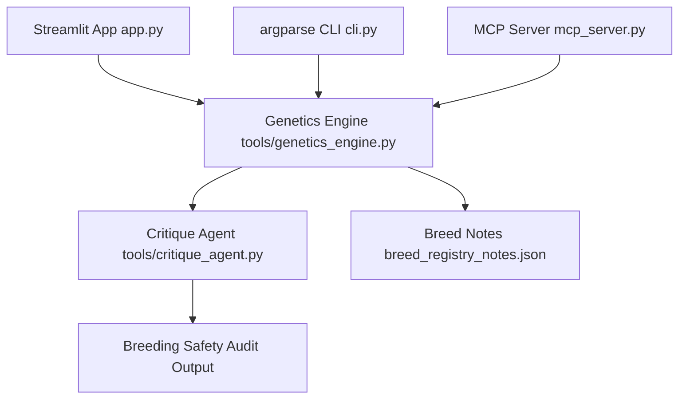

# 🧬 Equine Inheritance Simulator & Agentic Pipelines: Project Write-up
## Written by Jennifer Bailey
## July 5, 2026

---

## 1. Executive Summary
The **Equine Inheritance Simulator** is a production-grade biological simulation dashboard and multi-agent validation pipeline designed to model horse offspring coat color inheritance probabilities. Built with a premium dark-themed Streamlit interface, the application evaluates Mendelian crossovers across nine separate genetic loci simultaneously. It features an integrated safety compliance intercept agent (Critique Agent) that blocks unsafe breed pairings—specifically protecting against Lethal White Syndrome (LWS)—a standalone Command-line Interface (CLI), and a Model Context Protocol (MCP) server for agentic environments. 

---

## 2. Scientific & Biological Foundation
The genetics engine deterministic models map out complex genetic epistasis, dominance, and dilution effects:
- **Base Coat Loci**: Extension (`E`/`e`) and Agouti (`A`/`a`) establish the black, bay, or red/chestnut base.
- **Dilution Loci**: Co-dominance of Cream (`Cr`/`n`) and Pearl (`prl`/`n`) is modeled (e.g., Cream-Pearl double dilution), alongside Dun (`D`/`d`), Silver (`Z`/`z`), and Champagne (`Ch`/`ch`).
- **Progressive Masking**: Grey (`G`/`g`) acts epistatically over all colors, overriding final coats as the horse ages.
- **Lethal White Syndrome (LWS)**: Homozygosity for Frame Overo (`OO`) is fatal due to ileocolonic aganglionosis. The Critique Agent flags any cross with a non-zero probability of producing `OO` offspring.

---

## 3. System Architecture & Components
The system is divided into clean, decoupled layers:

- **Core Engine (`tools/genetics_engine.py`)**: Resolves Mendelian crossovers and executes phenotype resolutions. Highly optimized using Streamlit's `@st.cache_data` to ensure sub-second response times across a Cartesian combination space of up to $262,144$ options.
- **Critique Agent (`tools/critique_agent.py`)**: Intercepts calculations, auditing results against safety guidelines, and generates veterinary warning messages.
- **Model Context Protocol Server (`mcp_server.py`)**: Exposes the genetics calculator tool and the lethal-white safety standards resource over the open MCP standard.
- **CLI (`cli.py`)**: A bare-metal, high-performance command-line utility for shell scripting and manual calculations.

---

## 4. UI/UX Refinements
Special attention was given to user-interface polishing:
- **CSS Scrollbar & Padding Fixes**: Solved WebKit/Blink's `padding-bottom` collapsing bug in scrollable `overflow-y: auto` elements by nesting the terminal content inside a padded inner container, aligning margins symmetrically.
- **Double Border Removal**: Injecting clean CSS rules targeted Streamlit's default `
` borders inside expanders to keep the visual grid uniform.
- **Dynamic Underlying Code Walkthrough**: Real-time rendering of code logic via `st.code()` showing current sire and dam selections.

---

## 5. Quality Assurance & Automated Testing
A robust `pytest` suite guarantees engine mathematical accuracy and runtime constraints:
- **Unit Tests (`tests/test_genetics.py`)**: Asserts segregation, dominance sorting, phenotype translation, and safety audit flags.
- **Integration Tests (`tests/test_integration.py`)**: Validates the end-to-end simulation workflow and enforces strict 15-second execution timeout thresholds.

---

## 6. Containerization & Deployment
The system is fully containerized and configured for automated deployments:
- **Dockerfile**: Optimized multi-stage build running Streamlit under non-root user permissions.
- **Google Cloud Run (`deploy.sh`)**: Deploy script configured with hardcoded `--timeout=15` and `--max-instances=1` limits to comply with strict resource quotas.
